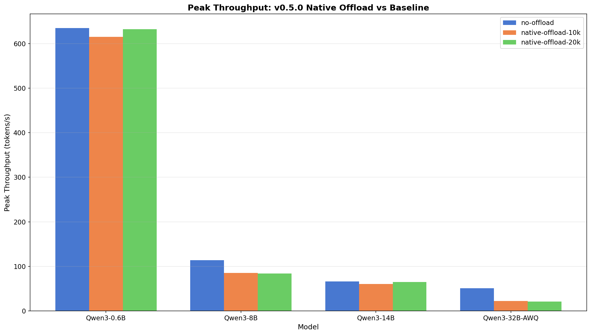
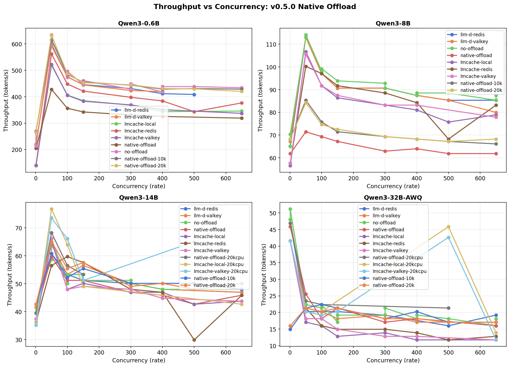

# llm-d v0.5.0 KV-Cache Management Evaluation

This report evaluates KV-cache offload strategies in llm-d v0.5.0 (vLLM 0.14.1) and compares performance with v0.4.0 (vLLM 0.11.2). The evaluation focuses on vLLM native CPU offload performance improvements and planned filesystem offload testing.

**Software Versions:**
- **llm-d**: v0.5.0 (vLLM 0.14.1, GuideLLM v0.5.3)
- **Comparison baseline**: llm-d v0.4.0 (vLLM 0.11.2, LMCache v0.3.7)

**Hardware:** 2x NVIDIA L40S GPUs, 48 vCPUs, OpenShift on IBM Cloud

**Models:** Qwen3-0.6B, Qwen3-8B, Qwen3-14B, Qwen3-32B-AWQ

**Concurrency levels:** 1, 50, 100, 150, 300, 400, 500, 650

---

## Summary

llm-d v0.5.0 brings vLLM 0.14.1, which significantly improves native CPU offload performance compared to v0.4.0's vLLM 0.11.2. This vLLM version introduces substantial changes to the KV offloading implementation:

- **CLI interface redesign**: The legacy `--kv-transfer-config` JSON syntax (v0.11.2) continues to work but vLLM's native interface moved to `--kv_offloading_backend` and `--kv_offloading_size` (v0.14.0+)
- **Physical block size increase**: KV-cache physical blocks grew from 8-32 KB (v0.11.0) to 0.5-2 MB (v0.12.0+) by consolidating all layers into contiguous blocks, increasing block size by a factor of 2×num_layers
- **Asynchronous DMA transfers**: New asynchronous offloading connector with Direct Memory Access for reduced transfer overhead

These architectural changes produce model-dependent performance patterns, with small models benefiting from reduced overhead while larger models show regressions potentially related to increased block transfer granularity.

**Key Findings:**

1. **Small models show substantial improvement**: Qwen3-0.6B improves from -29.1% degradation (v0.4.0) to -3.0% (v0.5.0) with 10K CPU blocks, and nearly eliminates degradation (-0.3%) with 20K blocks (+26.1 pp improvement).

2. **Medium models show moderate improvement**: Qwen3-8B improves from -36.5% to -25.2% (+11.3 pp), though significant overhead remains. Increased CPU capacity (20K blocks) provides no additional benefit.

3. **Large models regress**: Qwen3-14B shifts from +0.6% (v0.4.0) to -8.1% (v0.5.0), an -8.7 pp regression. With 20K blocks, performance recovers to -1.6%, but still underperforms v0.4.0 baseline.

4. **Quantized large models show degradation**: Qwen3-32B-AWQ experiences -56.2% throughput loss with native offload, compared to v0.4.0's -1.0%.

5. **CPU memory capacity matters for some models**: 0.6B and 14B show improvement with 20K blocks, while 8B and 32B-AWQ do not benefit.

**Comparison Summary:**

| Model | v0.4.0 Native (10K) | v0.5.0 Native (10K) | Improvement | v0.5.0 Native (20K) |
|-------|--------------------:|--------------------:|------------:|--------------------:|
| Qwen3-0.6B | -29.1% | -3.0% | **+26.1 pp** | -0.3% |
| Qwen3-8B | -36.5% | -25.2% | **+11.3 pp** | -26.1% |
| Qwen3-14B | +0.6% | -8.1% | **-8.7 pp** | -1.6% |
| Qwen3-32B-AWQ | -1.0% | -56.2% | **-55.2 pp** | -58.4% |

---

## Test Configuration

### Software Versions

- **llm-d**: v0.5.0 (vLLM 0.14.1)
- **GuideLLM**: v0.5.3
- **Comparison baseline**: llm-d v0.4.0 (vLLM 0.11.2, LMCache v0.3.7)

### Hardware Setup

**System:** OpenShift cluster on IBM Cloud
- **GPUs**: 2x NVIDIA L40S (48GB total VRAM)
  - Tensor Parallelism: 2 GPUs per model
- **CPU**: 48 vCPUs
- **Memory**: Sufficient for CPU KV-cache blocks (configuration-dependent)

### Workload Parameters

**Testing Approach**: High-concurrency multi-turn conversation workload
- **Concurrency Levels**: 1, 50, 100, 150, 300, 400, 500, 650
- **Duration**: 120 seconds per concurrency level
- **Prompt Structure**: Multi-turn conversations with shared prefix
  - Prompt tokens: 128 per turn
  - Output tokens: 128 per turn
  - Prefix tokens: 10,000 (shared across requests)
  - Turns: 5 per conversation
  - **Prefix count**: rate × 2 (corrected from v0.4.0 configuration for apples-to-apples comparison)
- **Sample requests**: 4000 per benchmark run

### Configurations Tested

**1. Baseline (no-offload)**
```bash
vllm serve <model> --tensor-parallel-size 2 --port 8000 --max-num-seq 1024
```

**2. Native CPU Offload (10K blocks)**
```bash
vllm serve <model> --tensor-parallel-size 2 --port 8000 --max-num-seq 1024 \
  --kv-transfer-config '{"kv_connector":"OffloadingConnector","kv_role":"kv_both",\
  "kv_connector_extra_config":{"num_cpu_blocks":10000}}'
```

**3. Native CPU Offload (20K blocks)**
```bash
vllm serve <model> --tensor-parallel-size 2 --port 8000 --max-num-seq 1024 \
  --kv-transfer-config '{"kv_connector":"OffloadingConnector","kv_role":"kv_both",\
  "kv_connector_extra_config":{"num_cpu_blocks":20000}}'
```

---

## Performance Results

### Peak Throughput Summary

Results show peak output token throughput achieved at optimal concurrency for each configuration.

| Model | Configuration | Peak Throughput (tok/s) | Optimal Concurrency | vs Baseline |
|-------|---------------|------------------------:|--------------------:|------------:|
| **Qwen3-0.6B** | no-offload | 634.7 | 50 | — |
| | native-offload-10k | 615.5 | 50 | **-3.0%** |
| | native-offload-20k | 632.5 | 50 | **-0.3%** |
| **Qwen3-8B** | no-offload | 114.1 | 50 | — |
| | native-offload-10k | 85.3 | 50 | **-25.2%** |
| | native-offload-20k | 84.3 | 50 | **-26.1%** |
| **Qwen3-14B** | no-offload | 66.1 | 50 | — |
| | native-offload-10k | 60.8 | 50 | **-8.1%** |
| | native-offload-20k | 65.1 | 50 | **-1.6%** |
| **Qwen3-32B-AWQ** | no-offload | 51.2 | 1 | — |
| | native-offload-10k | 22.4 | 100 | **-56.2%** |
| | native-offload-20k | 21.3 | 50 | **-58.4%** |


*Figure: Peak throughput across all models and configurations. Small models (0.6B) show near-parity with native offload, while larger models (32B-AWQ) show substantial degradation.*

### Comparison with v0.4.0 Performance

**Native Offload Performance Impact:**

| Model | v0.4.0 Native (10K) | v0.4.0 LMCache (10K) | v0.5.0 Native (10K) | Improvement vs v0.4.0 Native |
|-------|--------------------:|---------------------:|--------------------:|-----------------------------:|
| Qwen3-0.6B | **-29.1%** | -13.6% | **-3.0%** | **+26.1 pp** |
| Qwen3-8B | **-36.5%** | -5.6% | **-25.2%** | **+11.3 pp** |
| Qwen3-14B | +0.6% | +11.8% | **-8.1%** | **-8.7 pp** |
| Qwen3-32B-AWQ | -1.0% | -12.7% | **-56.2%** | **-55.2 pp** |


*Figure: v0.5.0 vs v0.4.0 performance change heatmap. Green shows improvement (small models), red shows regression (large models). Values represent percentage point change in throughput delta vs baseline.*

### Throughput vs Concurrency


*Figure: Throughput vs concurrency across all models. The 0.6B model shows convergence between baseline and offload at higher concurrency. The 32B-AWQ model shifts optimal concurrency from rate=1 to rate=100 with offload enabled.*

### Latency Analysis

Median latency metrics at peak throughput reveal offload overhead characteristics:

**Time to First Token (TTFT) at rate=50:**
- **0.6B**: 701ms (baseline) → 738ms (10K) → 949ms (20K) - offload increases queueing
- **8B**: 11.1s (baseline) → 16.1s (10K) → 16.3s (20K) - TTFT degradation
- **14B**: 22.8s (baseline) → 21.6s (10K) → 23.4s (20K) - mixed results
- **32B-AWQ**: 101ms @ rate=1 (baseline) → 31.4s @ rate=100 (10K) - in optimal concurrency

**Inter-Token Latency (ITL) median:**
- **0.6B**: 68.1ms (baseline) → 68.5ms (10K) - minimal impact
- **8B**: 257ms (baseline) → 341ms (10K) - +33% latency increase
- **14B**: 311ms (baseline) → 314ms (10K) - minimal impact


*Figure: Latency comparison at peak throughput. TTFT and ITL show varying offload overhead across models. The 32B-AWQ model's latency spike reflects the shift in optimal concurrency from rate=1 to rate=100.*

---

## Analysis

### vLLM 0.14.1 Native Offload Improvements

vLLM 0.14.1 (llm-d v0.5.0) significantly improves native CPU offload performance for small models compared to vLLM 0.11.2 (llm-d v0.4.0).

**Small Model Improvements (0.6B, 8B):**
- **Qwen3-0.6B**: Overhead reduced from -29.1% to -3.0% (+26.1 pp improvement). With 20K CPU blocks, degradation nearly eliminated (-0.3%).
- **Qwen3-8B**: Overhead reduced from -36.5% to -25.2% (+11.3 pp improvement), though significant overhead remains.

These improvements suggest vLLM 0.14.1 has more efficient CPU-GPU transfer mechanisms or better scheduling for small models with abundant GPU memory.

**Large Model Regressions (14B, 32B-AWQ):**
- **Qwen3-14B**: Performance shifts from +0.6% (v0.4.0) to -8.1% (v0.5.0), an -8.7 pp regression. With 20K blocks, performance recovers to -1.6%, but still underperforms v0.4.0.
- **Qwen3-32B-AWQ**: -56.2% throughput loss (vs v0.4.0's -1.0%).

**Physical Block Size Impact:**

The increase in physical block size from 8-32 KB (v0.11.0) to 0.5-2 MB (v0.12.0+) may contribute to these model-dependent patterns. Larger models with more layers see proportionally larger block sizes (2×num_layers factor), potentially explaining why:
- Small models benefit from reduced transfer overhead (fewer smaller blocks to manage)
- Large models face increased transfer granularity (larger contiguous blocks per transfer)
- Quantized models (32B-AWQ) may interact poorly with the new block structure

**CPU Memory Capacity Impact:**
- **0.6B and 14B** benefit from increased CPU blocks (20K vs 10K)
- **8B and 32B-AWQ** show no benefit or further degradation with 20K blocks

### Latency Overhead Patterns

**TTFT degradation** is largest for medium models (8B: +45%, 14B: mixed).

**ITL impact** is modest for small models (0.6B: +0.6%) but larger for medium models (8B: +33%).

**Concurrency shift** for 32B-AWQ (optimal rate changes from 1 to 100 with offload).

---

## Conclusions

### vLLM 0.14.1 Native Offload Assessment

vLLM 0.14.1 brings significant improvements to native CPU offload for small models, reducing overhead from -29% to -3% for the 0.6B model. Larger models show regressions, with the 14B model shifting from +0.6% to -8.1% and the 32B-AWQ model showing -56.2% degradation.

---

## Appendix: Methodology

### Benchmark Execution

All benchmarks executed using GuideLLM v0.5.3 with identical parameters:
- Profile: concurrent
- Duration: 120 seconds per concurrency level
- Sample requests: 4000
- Prefer response metrics: true

### Data Files

**Raw Data:**
- GuideLLM JSON results: `results/1x2xL40S_upstream-llm-d-0.5.0_*/guidellm-results.json.zst`
- PCP archives: `results/*/pcp-archives/` (to be collected)
- vLLM startup logs: `results/*/vllm-startup.log.zst`

**Analysis Scripts:**
- PREFIX_COUNT correction analysis: `scripts/analyze-v0.5.0-results.py`
- Throughput comparison: `scripts/analyze-v0.5.0-comparison.py`
- v0.4.0 vs v0.5.0 delta: `scripts/analyze-v0.5.0-throughput.py`

See [README.md](README.md) for complete documentation.

---

*Report generated from benchmark runs completed March 2026*
*Analysis framework: Performance Co-Pilot + GuideLLM*
*System: OpenShift on IBM Cloud with 2x NVIDIA L40S GPUs*
