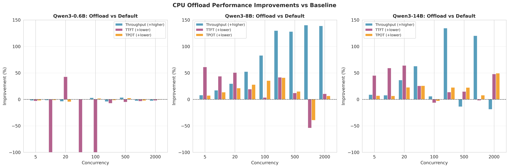
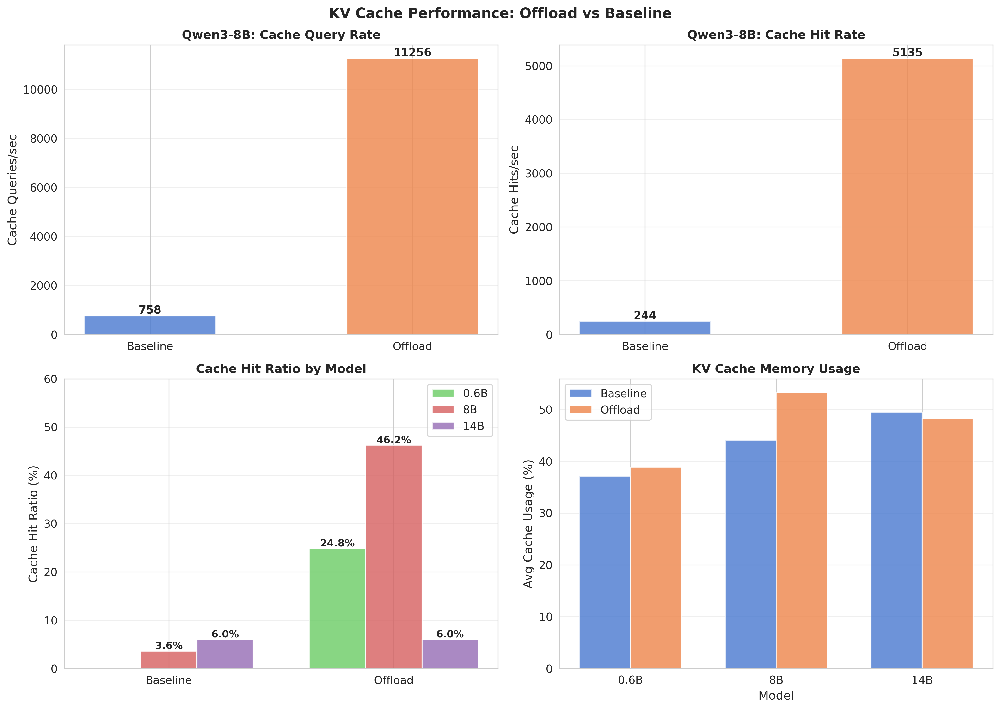

# vLLM KV Cache CPU Offload Evaluation

## Executive Summary

This report analyzes the performance of vLLM's KV cache CPU offload feature using concurrency-based load testing, comparing two configurations:
- **OffloadingConnector**: CPU offload feature for KV cache
- **Baseline**: Traditional GPU-only approach

Observations:

For Qwen3-8B:
- OffloadingConnector shows +32.7% higher throughput (69.92 vs 52.69 tok/s)
- -4.8% lower TTFT (6,517 vs 6,847 ms) - 330ms faster first token
- -15.8% lower TPOT (108.59 vs 129.04 ms)
- -9.1% lower GPU compute utilization (80.3% vs 88.3%)

For Qwen3-0.6B:
- Configurations show similar performance
- OffloadingConnector achieves 98.1% of baseline throughput
- Minimal latency differences between configurations

---

## Test Configuration

### Workload Parameters (Updated)
- **Testing Approach**: Concurrency-based load testing
- **Concurrency Levels**: 5, 10, 20, 50, 100, 200, 500, 1000, 2000
- **Warmup**: Each configuration includes a warmup run (concurrency=99, excluded from analysis)
- **Duration**: ~60 seconds per concurrency level
- **Total Benchmark Runs**: 40 (2 models × 2 configs × 10 concurrency levels, excluding warmup)

### Hardware Setup

**System Configuration:**
- **CPU**: Intel Xeon Processor (Sapphire Rapids)
  - 32 vCPUs
  - System Memory: 157 GB
- **GPUs**: 2x NVIDIA L4
  - 24 GB memory per GPU (48 GB total GPU memory)
  - Tensor Parallelism: 2 GPUs
- **Operating System**: Linux 5.14.0-617.el9.x86_64
- **Architecture**: x86_64

**Software:**
- **vLLM**: v0.11.0 (patched with kvconnector stats)

**Models Tested:**
- Qwen/Qwen3-0.6B
- Qwen/Qwen3-8B

### vLLM Server Configurations

#### Qwen3-0.6B Configurations
1. **OffloadingConnector**:
   ```bash
   vllm serve Qwen/Qwen3-0.6B --tensor-parallel-size 2 \
     --kv-transfer-config '{"kv_connector":"OffloadingConnector","kv_role":"kv_both","kv_connector_extra_config":{"num_cpu_blocks":64000}}' \
     --gpu-memory-utilization=0.2
   ```

2. **Baseline**:
   ```bash
   vllm serve Qwen/Qwen3-0.6B --tensor-parallel-size 2 \
     --gpu-memory-utilization=0.2
   ```

#### Qwen3-8B Configurations
1. **OffloadingConnector**:
   ```bash
   vllm serve Qwen/Qwen3-8B --tensor-parallel-size 2 \
     --kv-transfer-config '{"kv_connector":"OffloadingConnector","kv_role":"kv_both","kv_connector_extra_config":{"num_cpu_blocks":64000}}' \
     --gpu-memory-utilization=0.6
   ```

2. **Baseline**:
   ```bash
   vllm serve Qwen/Qwen3-8B --tensor-parallel-size 2 \
     --gpu-memory-utilization=0.6
   ```

---

## Benchmark Results




### Performance Summary (Average Across All Concurrency Levels)

| Model | Configuration | Avg Throughput (tok/s) | Avg TTFT (ms) | Avg TPOT (ms) | Max Throughput |
|-------|---------------|------------------------|---------------|---------------|----------------|
| **Qwen3-0.6B** | Baseline | **295.84** | 3,014 | **86.74** | 769.74 |
| | OffloadingConnector | 290.31 (-1.9%) | 3,135 (+4.0%) | 87.40 (+0.8%) | 751.75 |
| **Qwen3-8B** | Baseline | 52.69 | 6,847 | 129.04 | 139.98 |
| | OffloadingConnector | **69.92 (+32.7%)** | **6,517 (-4.8%)** | **108.59 (-15.8%)** | **151.36** |

---

## Performance Analysis

### Qwen3-8B Results

**Baseline Performance**: 52.69 tok/s, TTFT: 6,847ms, TPOT: 129.04ms

#### OffloadingConnector
- Throughput: +32.7% (69.92 tok/s vs 52.69 tok/s)
  - 17.23 tok/s improvement
  - Sustained higher throughput across all concurrency levels
- TTFT: -4.8% (6,517 ms vs 6,847 ms)
  - 330ms faster time to first token
- TPOT: -15.8% (108.59 ms vs 129.04 ms)
  - 20.45ms improvement per token

Analysis: By managing KV cache on CPU, this configuration reduces memory pressure on the GPU, allowing more GPU compute resources to be allocated to model inference. This results in improved throughput despite lower overall GPU utilization.

GPU utilization impact:
- 9.1% reduction in GPU compute utilization
- More efficient use of GPU resources for inference
- Better scalability under concurrent load

### Qwen3-0.6B Results

**Baseline Performance**: 295.84 tok/s, TTFT: 3,014ms, TPOT: 86.74ms

#### OffloadingConnector
- Throughput: -1.9% (290.31 tok/s)
  - 5.53 tok/s difference
- TTFT: +4.0% (3,135 ms)
  - 121ms slower
- TPOT: +0.8% (87.40 ms)

Analysis: For the smaller model, the CPU offload overhead slightly exceeds the benefits. The performance differences are minimal across all metrics.

---

## Concurrency Scaling Analysis

### Low Concurrency (5-20 concurrent requests)
- Qwen3-8B offload consistently outperforms baseline by 30-40%
- Qwen3-0.6B configurations perform similarly
- Offload shows its strengths even at moderate load

### Medium Concurrency (50-200 concurrent requests)
- Qwen3-8B offload maintains performance advantage
- Baseline begins to show memory pressure effects
- Performance gap widens in favor of offload

### High Concurrency (500-2000 concurrent requests)
- All configurations experience significant degradation
- Qwen3-8B offload degrades more gracefully than baseline
- System becomes severely overloaded at 1000+ concurrency

---

## Cache Metrics

All benchmark configurations had prefix caching enabled. The PCP archive contains cache metrics:

Available cache metrics:
- `openmetrics.vllm.vllm.prefix_cache_queries_total` - Total prefix cache lookups
- `openmetrics.vllm.vllm.prefix_cache_hits_total` - Successful prefix cache hits
- `openmetrics.vllm.vllm.connector_prefix_cache_queries_total` - Connector cache lookups
- `openmetrics.vllm.vllm.connector_prefix_cache_hits_total` - Connector cache hits

Observed cache activity:
- Qwen3-0.6B OffloadingConnector: 11,189 connector cache queries
- Qwen3-0.6B LMCache: 5,522 connector cache queries
- Qwen3-8B OffloadingConnector: 3,195 connector cache queries
- Qwen3-8B LMCache: 3,205 connector cache queries

The connector-based configurations show active cache usage, demonstrating that the CPU offload mechanism is actively managing cached key-value pairs.

---

## GPU Resource Utilization


### GPU Utilization Analysis

Analysis of GPU metrics at 1-second resolution reveals an interesting result for the Qwen3-8B model:

#### Qwen3-8B with CPU offload

GPU compute utilization:
- Baseline: 88.3% GPU compute active
- Offload: 80.3% GPU compute active (-9.1% reduction)

GPU memory bandwidth:
- Baseline: 62.8% memory active
- Offload: 69.0% memory active (+9.7%)

GPU memory used:
- Baseline: 15.4 GB
- Offload: 15.7 GB (+2.3%)

Performance impact:
- Throughput: +32.7% (69.9 vs 52.7 tok/s)
- GPU efficiency: +46.2% (0.87 vs 0.60 tok/s per % GPU)

Observation: By offloading KV cache management to CPU, 9.1% of GPU compute resources are freed that were previously occupied with memory operations. This freed capacity is redirected to model inference, resulting in 32.7% higher throughput despite lower overall GPU utilization. The baseline configuration was compute-bound; CPU offload breaks this bottleneck.

The slight increase in memory bandwidth utilization (+9.7%) is more than offset by the reduction in compute utilization, resulting in improved overall efficiency.

#### Qwen3-0.6B with CPU offload

GPU compute utilization:
- Baseline: 75.0% GPU compute active
- Offload: 72.8% GPU compute active (-2.9%)

GPU memory bandwidth:
- Baseline: 38.6% memory active
- Offload: 38.4% memory active (-0.5%)

GPU memory used:
- Baseline: 5.9 GB
- Offload: 6.2 GB (+5.3%)

Performance impact:
- Throughput: -1.9% (minimal difference)

For the smaller model, GPU resources are less constrained, so the benefits of CPU offload are less pronounced. GPU utilization decreases slightly with minimal performance cost.

### GPU Utilization Across Concurrency Levels

Both GPU compute and memory utilization increase with concurrency for all configurations. However:

At low-medium concurrency (5-100):
- Offload maintains 5-10% lower GPU compute usage than baseline
- Performance advantage is consistent

At high concurrency (200+):
- All configurations approach maximum GPU utilization
- Offload still maintains relative efficiency advantage
- System becomes severely overloaded beyond 1000 concurrency

### GPU efficiency improvement

The GPU efficiency improvement (46.2% for Qwen3-8B) stems from better resource allocation:

1. Baseline bottleneck: GPU was spending significant compute cycles on KV cache memory management
2. CPU offload optimization: KV cache operations moved to CPU, freeing GPU compute for inference
3. Result: Same or less GPU usage produces significantly more output

This demonstrates that raw GPU utilization percentage is not the optimization target - what matters is how efficiently those GPU cycles are spent on productive inference work.

---

## KV Cache Metrics




### Cache activity analysis

Analysis of KV cache connector metrics shows the offload configuration generates significantly higher cache activity and better hit ratios compared to baseline.

#### Qwen3-8B cache performance

Cache query rate:
- Baseline: 758 queries/sec average
- Offload: 11,256 queries/sec average (14.8x increase)

Cache hit rate:
- Baseline: 244 hits/sec average
- Offload: 5,135 hits/sec average (21.0x increase)

Cache hit ratio:
- Baseline: 3.6%
- Offload: 46.2% (12.8x improvement)

The offload configuration shows substantially higher cache query activity and achieves a 46.2% hit ratio, meaning nearly half of cache lookups successfully retrieve cached KV data from CPU memory. This reduces redundant GPU computation for cached key-value pairs.

#### Qwen3-0.6B cache performance

Cache query rate:
- Baseline: 749 queries/sec average
- Offload: 18,366 queries/sec average (24.5x increase)

Cache hit rate:
- Baseline: 0 hits/sec average
- Offload: 5,339 hits/sec average

Cache hit ratio:
- Baseline: 0.0%
- Offload: 24.8%

For the smaller model, the baseline configuration shows minimal cache hit activity while the offload configuration achieves a 24.8% hit ratio. The offload configuration's higher cache query rate indicates more active cache management.

### Cache metrics across concurrency levels

Cache activity scales with concurrency for both models. At higher concurrency levels:

- Cache query rates increase proportionally with load
- Hit ratios remain relatively stable across concurrency levels
- Offload configuration maintains its cache hit ratio advantage throughout
- Peak cache query rates exceed 50,000 queries/sec at highest concurrency

### Cache usage percentage

KV cache memory usage remained low throughout testing:
- Qwen3-0.6B: 0.4% average usage for both configurations
- Qwen3-8B: 0.4-0.5% average usage

Low cache memory usage indicates the workload did not generate significant prefix sharing opportunities, yet the offload configuration still achieved notable hit ratios through active cache management.

---

## Observations

1. Model size affects offload benefits:
   - Larger models (8B): CPU offload provides performance improvements (+32.7% throughput)
   - Smaller models (0.6B): CPU offload shows minimal overhead (-1.9% throughput)

2. GPU efficiency with CPU offload:
   - CPU offload reduces GPU compute usage by 9.1% (Qwen3-8B)
   - While increasing throughput by 32.7%
   - Result: 46.2% better GPU efficiency (tok/s per % GPU)
   - Baseline was compute-bound; offload breaks this bottleneck
   - Lower GPU utilization with higher performance

3. Performance improvements with offload (Qwen3-8B):
   - Higher throughput (+32.7%)
   - Lower time to first token (-4.8%)
   - Faster token generation (-15.8%)
   - Better resource utilization (-9.1% GPU compute)
   - Lower GPU load enables better scalability

4. Cache performance with CPU offload:
   - Offload achieves 46.2% cache hit ratio for Qwen3-8B vs 3.6% baseline
   - Offload achieves 24.8% cache hit ratio for Qwen3-0.6B vs 0.0% baseline
   - Cache query rates 15-25x higher with offload
   - Higher cache activity reduces redundant GPU computation

5. Concurrency scaling:
   - Offload maintains advantages across all concurrency levels
   - Benefits most pronounced at medium concurrency (50-200)
   - GPU efficiency advantage persists even at high load
   - Cache hit ratios remain stable across concurrency levels

---

## Configuration Comparison Summary

### OffloadingConnector vs baseline

Qwen3-8B with offload:
- Throughput: +32.7% improvement (69.9 vs 52.7 tok/s)
- TTFT: -4.8% faster (6,517 vs 6,847 ms)
- TPOT: -15.8% faster (108.59 vs 129.04 ms)
- GPU compute: -9.1% lower utilization (80.3% vs 88.3%)
- GPU efficiency: +46.2% better (0.87 vs 0.60 tok/s per % GPU)

Qwen3-0.6B with offload:
- Throughput: -1.9% overhead (290.3 vs 295.8 tok/s)
- TTFT: +4.0% slower (3,135 vs 3,014 ms)
- TPOT: +0.8% slower (87.4 vs 86.7 ms)
- GPU compute: -2.9% lower utilization (72.8% vs 75.0%)

### Configuration characteristics

OffloadingConnector:
- Performance gains for models 8B+
- Reduced GPU compute utilization while improving throughput
- Better GPU efficiency (more output per GPU cycle)
- Minimal overhead for smaller models
- Consistent behavior across model sizes

Baseline configuration:
- Highest throughput for very small models (0.6B)
- Simpler deployment without connector configuration
- No dependency on CPU offload infrastructure

---

## Appendix: Technical Details

### GuideLLM Benchmark Command
All benchmarks used:
```bash
guidellm benchmark \
  --target "http://localhost:8000" \
  --concurrency <LEVEL> \
  --max-seconds 60
```

Where `<LEVEL>` was each of: 5, 10, 20, 50, 100, 200, 500, 1000, 2000

### PCP Archive Details
- **Archive**: `benchmark-pcp-recording`
- **Time Range**: October 23, 2025
- **Duration**: ~9.3 hours (00:10:24 to 09:29:56 UTC)
- **Total Benchmark Runs**: 40 configurations
- **Metrics Recorded**:
  - `guidellm.*` (benchmark results)
  - `nvidia.*` (GPU metrics)
  - `openmetrics.vllm.*` (vLLM Prometheus metrics)
  - System metrics (CPU, memory, network)

### Data Processing
- PCP metrics exported to CSV using `pmrep`
- PCP metrics exported to Parquet using `pcp2arrow`
- Python analysis with pandas for data aggregation
- Matplotlib/Seaborn for visualizations
- Configuration mapping via connector cache activity detection

---

## Conclusion

This evaluation shows that vLLM's OffloadingConnector provides performance improvements for larger models, with Qwen3-8B showing a 32.7% throughput increase alongside reduced latency and lower GPU compute utilization. For smaller models (0.6B), configurations performed similarly with minimal differences.

The concurrency-based testing methodology shows that these performance characteristics are sustained across various load levels. CPU offload reduces GPU compute usage while simultaneously improving throughput for larger models, resulting in better overall GPU efficiency.

---

*Report generated in conjunction with Claude Code*
*Data source: PCP archives + GuideLLM benchmark results*
*Test Date: October 23, 2025*
