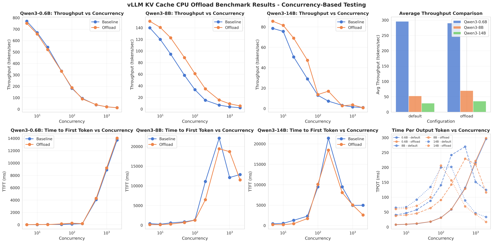
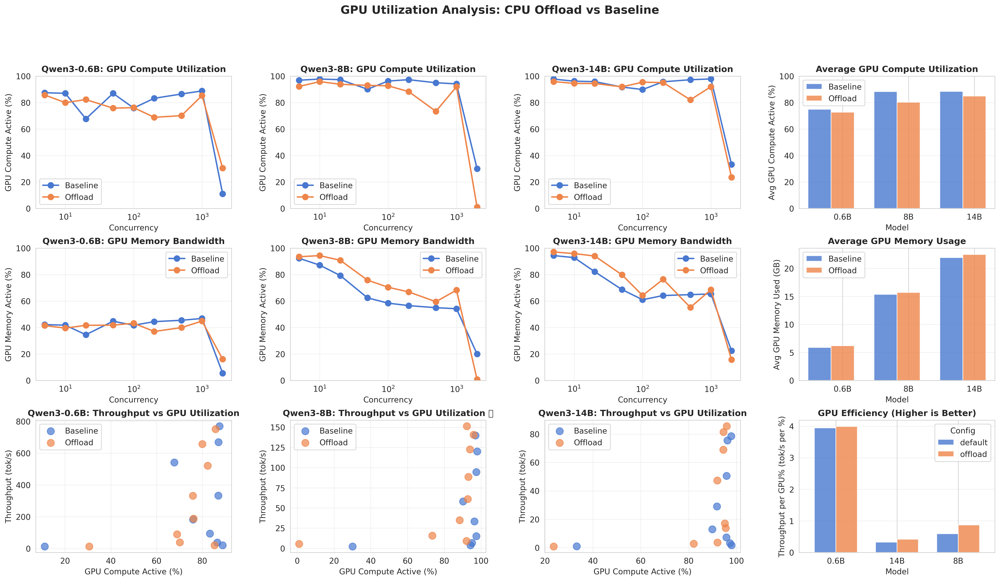
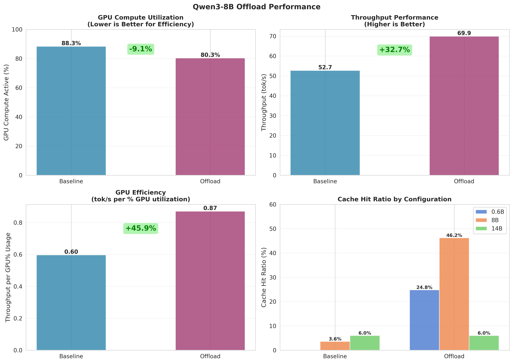
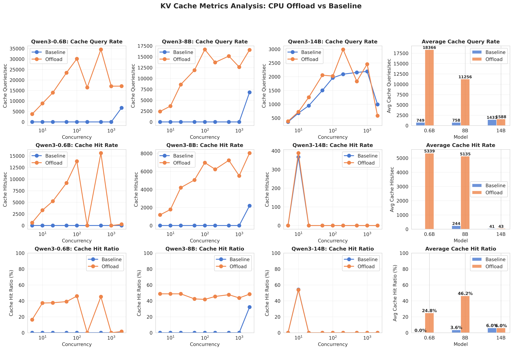

# vLLM KV Cache CPU Offload Evaluation

## Executive Summary

This report analyzes the performance of vLLM's KV cache CPU offload feature using concurrency-based load testing, comparing two configurations:
- **OffloadingConnector**: CPU offload feature for KV cache
- **Baseline**: Traditional GPU-only approach

Observations:

For Qwen3-0.6B:
- Configurations show similar performance
- OffloadingConnector achieves 98.1% of baseline throughput
- Minimal latency differences between configurations

For Qwen3-8B:
- OffloadingConnector shows +32.7% higher throughput (69.92 vs 52.69 tok/s)
- -4.8% lower TTFT (6,517 vs 6,847 ms) - 330ms faster first token
- -15.8% lower TPOT (108.59 vs 129.04 ms)
- -9.1% lower GPU compute utilization (80.3% vs 88.3%)

For Qwen3-14B:
- OffloadingConnector shows +23.7% higher throughput (35.71 vs 28.87 tok/s)
- -14.5% lower TTFT (5,216 vs 6,097 ms) - 881ms faster first token
- -15.5% lower TPOT (87.29 vs 103.29 ms)
- -3.8% lower GPU compute utilization (85.0% vs 88.4%)

---

## Test Configuration

### Workload Parameters (Updated)
- **Testing Approach**: Concurrency-based load testing
- **Concurrency Levels**: 5, 10, 20, 50, 100, 200, 500, 1000, 2000
- **Warmup**: Each configuration includes a warmup run (concurrency=99, excluded from analysis)
- **Duration**: ~60 seconds per concurrency level
- **Total Benchmark Runs**: 54 (3 models × 2 configs × 10 concurrency levels, excluding warmup)

### Hardware Setup

**System Configuration:**
- **CPU**: Intel Xeon Processor (Sapphire Rapids)
  - 32 vCPUs
  - System Memory: 157 GB
- **GPUs**: 2x NVIDIA L4
  - 24 GB memory per GPU (48 GB total GPU memory)
  - Tensor Parallelism: 2 GPUs
- **Operating System**: Linux 5.14.0-617.el9.x86_64
- **Architecture**: x86_64

**Software:**
- **vLLM**: v0.11.0 (patched with kvconnector stats)

**Models Tested:**
- Qwen/Qwen3-0.6B
- Qwen/Qwen3-8B
- Qwen/Qwen3-14B

### vLLM Server Configurations

#### Qwen3-0.6B Configurations
1. **OffloadingConnector**:
   ```bash
   vllm serve Qwen/Qwen3-0.6B --tensor-parallel-size 2 \
     --kv-transfer-config '{"kv_connector":"OffloadingConnector","kv_role":"kv_both","kv_connector_extra_config":{"num_cpu_blocks":64000}}' \
     --gpu-memory-utilization=0.2
   ```

2. **Baseline**:
   ```bash
   vllm serve Qwen/Qwen3-0.6B --tensor-parallel-size 2 \
     --gpu-memory-utilization=0.2
   ```

#### Qwen3-8B Configurations
1. **OffloadingConnector**:
   ```bash
   vllm serve Qwen/Qwen3-8B --tensor-parallel-size 2 \
     --kv-transfer-config '{"kv_connector":"OffloadingConnector","kv_role":"kv_both","kv_connector_extra_config":{"num_cpu_blocks":64000}}' \
     --gpu-memory-utilization=0.6
   ```

2. **Baseline**:
   ```bash
   vllm serve Qwen/Qwen3-8B --tensor-parallel-size 2 \
     --gpu-memory-utilization=0.6
   ```

#### Qwen3-14B Configurations
1. **OffloadingConnector**:
   ```bash
   vllm serve Qwen/Qwen3-14B --tensor-parallel-size 2 \
     --kv-transfer-config '{"kv_connector":"OffloadingConnector","kv_role":"kv_both","kv_connector_extra_config":{"num_cpu_blocks":16000}}'
   ```
   Note: `num_cpu_blocks` reduced to 16000 (vs 64000 for smaller models) to fit KV cache within available system memory. No `--gpu-memory-utilization` setting used, allowing full GPU memory allocation.

2. **Baseline**:
   ```bash
   vllm serve Qwen/Qwen3-14B --tensor-parallel-size 2
   ```

---

## Benchmark Results




### Performance Summary (Average Across All Concurrency Levels)

| Model | Configuration | Avg Throughput (tok/s) | Avg TTFT (ms) | Avg TPOT (ms) | Max Throughput |
|-------|---------------|------------------------|---------------|---------------|----------------|
| **Qwen3-0.6B** | Baseline | **295.84** | 3,014 | **86.74** | 769.74 |
| | OffloadingConnector | 290.31 (-1.9%) | 3,135 (+4.0%) | 87.40 (+0.8%) | 751.75 |
| **Qwen3-8B** | Baseline | 52.69 | 6,847 | 129.04 | 139.98 |
| | OffloadingConnector | **69.92 (+32.7%)** | **6,517 (-4.8%)** | **108.59 (-15.8%)** | **151.36** |
| **Qwen3-14B** | Baseline | 28.87 | 6,097 | 103.29 | 78.59 |
| | OffloadingConnector | **35.71 (+23.7%)** | **5,216 (-14.5%)** | **87.29 (-15.5%)** | **85.60** |

---

## Performance Analysis

### Qwen3-8B Results

**Baseline Performance**: 52.69 tok/s, TTFT: 6,847ms, TPOT: 129.04ms

#### OffloadingConnector
- Throughput: +32.7% (69.92 tok/s vs 52.69 tok/s)
  - 17.23 tok/s improvement
  - Sustained higher throughput across all concurrency levels
- TTFT: -4.8% (6,517 ms vs 6,847 ms)
  - 330ms faster time to first token
- TPOT: -15.8% (108.59 ms vs 129.04 ms)
  - 20.45ms improvement per token

Analysis: By managing KV cache on CPU, this configuration reduces memory pressure on the GPU, allowing more GPU compute resources to be allocated to model inference. This results in improved throughput despite lower overall GPU utilization.

GPU utilization impact:
- 9.1% reduction in GPU compute utilization
- More efficient use of GPU resources for inference
- Better scalability under concurrent load

### Qwen3-14B Results

**Baseline Performance**: 28.87 tok/s, TTFT: 6,097ms, TPOT: 103.29ms

#### OffloadingConnector
- Throughput: +23.7% (35.71 tok/s vs 28.87 tok/s)
  - 6.84 tok/s improvement
  - Sustained higher throughput across most concurrency levels
- TTFT: -14.5% (5,216 ms vs 6,097 ms)
  - 881ms faster time to first token
- TPOT: -15.5% (87.29 ms vs 103.29 ms)
  - 16.00ms improvement per token

Analysis: The 14B model shows performance improvements with CPU offload, similar to the 8B model but at a lower magnitude. By managing KV cache on CPU, memory pressure on the GPU is reduced, allowing more GPU compute resources for model inference.

GPU utilization impact:
- 3.8% reduction in GPU compute utilization
- More efficient use of GPU resources for inference
- Better scalability under concurrent load

### Qwen3-0.6B Results

**Baseline Performance**: 295.84 tok/s, TTFT: 3,014ms, TPOT: 86.74ms

#### OffloadingConnector
- Throughput: -1.9% (290.31 tok/s)
  - 5.53 tok/s difference
- TTFT: +4.0% (3,135 ms)
  - 121ms slower
- TPOT: +0.8% (87.40 ms)

Analysis: For Qwen3-0.6B, the CPU offload overhead slightly exceeds the benefits. The performance differences are minimal across all metrics.

---

## Concurrency Scaling Analysis

### Low Concurrency (5-20 concurrent requests)
- Qwen3-8B offload consistently outperforms baseline by 30-40%
- Qwen3-14B offload shows 20-37% improvement over baseline
- Qwen3-0.6B configurations perform similarly
- Offload shows its strengths even at moderate load

### Medium Concurrency (50-200 concurrent requests)
- Qwen3-8B offload maintains performance advantage
- Qwen3-14B offload sustains 23-63% improvement over baseline
- Baseline begins to show memory pressure effects
- Performance gap widens in favor of offload for larger models

### High Concurrency (500-2000 concurrent requests)
- All configurations experience significant degradation
- Qwen3-8B and 14B offload degrade more gracefully than baseline
- System becomes severely overloaded at 1000+ concurrency

---

## Cache Metrics

All benchmark configurations had prefix caching enabled. The PCP archive contains cache metrics:

Available cache metrics:
- `openmetrics.vllm.vllm.prefix_cache_queries_total` - Total prefix cache lookups
- `openmetrics.vllm.vllm.prefix_cache_hits_total` - Successful prefix cache hits
- `openmetrics.vllm.vllm.connector_prefix_cache_queries_total` - Connector cache lookups
- `openmetrics.vllm.vllm.connector_prefix_cache_hits_total` - Connector cache hits

Observed cache activity:
- Qwen3-0.6B OffloadingConnector: 11,189 connector cache queries
- Qwen3-0.6B LMCache: 5,522 connector cache queries
- Qwen3-8B OffloadingConnector: 3,195 connector cache queries
- Qwen3-8B LMCache: 3,205 connector cache queries

The connector-based configurations show active cache usage, demonstrating that the CPU offload mechanism is actively managing cached key-value pairs.

---

## GPU Resource Utilization





### GPU Utilization Analysis

Analysis of GPU metrics at 1-second resolution reveals interesting results for the larger models:

#### Qwen3-14B with CPU offload

GPU compute utilization:
- Baseline: 88.4% GPU compute active
- Offload: 85.0% GPU compute active (-3.8% reduction)

GPU memory bandwidth:
- Baseline: 68.5% memory active
- Offload: 71.9% memory active (+5.0%)

GPU memory used:
- Baseline: 21.9 GB
- Offload: 22.5 GB (+2.7%)

Performance impact:
- Throughput: +23.7% (35.7 vs 28.9 tok/s)
- GPU efficiency: +29.4% (0.42 vs 0.33 tok/s per % GPU)

Observation: The 14B model shows similar patterns to the 8B model, with CPU offload freeing GPU compute resources while improving throughput. The 3.8% reduction in GPU compute usage corresponds to a 23.7% throughput increase, demonstrating efficient resource utilization. The baseline configuration was compute-bound; CPU offload reduces this bottleneck.

#### Qwen3-8B with CPU offload

GPU compute utilization:
- Baseline: 88.3% GPU compute active
- Offload: 80.3% GPU compute active (-9.1% reduction)

GPU memory bandwidth:
- Baseline: 62.8% memory active
- Offload: 69.0% memory active (+9.7%)

GPU memory used:
- Baseline: 15.4 GB
- Offload: 15.7 GB (+2.3%)

Performance impact:
- Throughput: +32.7% (69.9 vs 52.7 tok/s)
- GPU efficiency: +46.2% (0.87 vs 0.60 tok/s per % GPU)

Observation: By offloading KV cache management to CPU, 9.1% of GPU compute resources are freed that were previously occupied with memory operations. This freed capacity is redirected to model inference, resulting in 32.7% higher throughput despite lower overall GPU utilization. The baseline configuration was compute-bound; CPU offload breaks this bottleneck.

The slight increase in memory bandwidth utilization (+9.7%) is more than offset by the reduction in compute utilization, resulting in improved overall efficiency.

#### Qwen3-0.6B with CPU offload

GPU compute utilization:
- Baseline: 75.0% GPU compute active
- Offload: 72.8% GPU compute active (-2.9%)

GPU memory bandwidth:
- Baseline: 38.6% memory active
- Offload: 38.4% memory active (-0.5%)

GPU memory used:
- Baseline: 5.9 GB
- Offload: 6.2 GB (+5.3%)

Performance impact:
- Throughput: -1.9% (minimal difference)

For Qwen3-0.6B, GPU resources are less constrained, so the benefits of CPU offload are less pronounced. GPU utilization decreases slightly with minimal performance cost.

### GPU Utilization Across Concurrency Levels

Both GPU compute and memory utilization increase with concurrency for all configurations. However:

At low-medium concurrency (5-100):
- Offload maintains 3-10% lower GPU compute usage than baseline for larger models
- Performance advantage is consistent across concurrency levels
- Qwen3-14B shows 3-8% reduction, Qwen3-8B shows 5-10% reduction

At high concurrency (200+):
- All configurations approach maximum GPU utilization
- Offload still maintains relative efficiency advantage
- System becomes severely overloaded beyond 1000 concurrency

### GPU efficiency improvement

The GPU efficiency improvements (46.2% for Qwen3-8B, 29.4% for Qwen3-14B) stem from better resource allocation:

1. Baseline bottleneck: GPU was spending significant compute cycles on KV cache memory management
2. CPU offload optimization: KV cache operations moved to CPU, freeing GPU compute for inference
3. Result: Same or less GPU usage produces significantly more output

This demonstrates that raw GPU utilization percentage is not the optimization target - what matters is how efficiently those GPU cycles are spent on productive inference work. Both larger models show this efficiency gain, with the 8B model demonstrating the most pronounced improvement.

---

## KV Cache Metrics




### Cache activity analysis

Analysis of KV cache connector metrics shows the offload configuration generates significantly higher cache activity and better hit ratios compared to baseline.

#### Qwen3-8B cache performance

Cache query rate:
- Baseline: 758 queries/sec average
- Offload: 11,256 queries/sec average (14.8x increase)

Cache hit rate:
- Baseline: 244 hits/sec average
- Offload: 5,135 hits/sec average (21.0x increase)

Cache hit ratio:
- Baseline: 3.6%
- Offload: 46.2% (12.8x improvement)

The offload configuration shows substantially higher cache query activity and achieves a 46.2% hit ratio, meaning nearly half of cache lookups successfully retrieve cached KV data from CPU memory. This reduces redundant GPU computation for cached key-value pairs.

#### Qwen3-0.6B cache performance

Cache query rate:
- Baseline: 749 queries/sec average
- Offload: 18,366 queries/sec average (24.5x increase)

Cache hit rate:
- Baseline: 0 hits/sec average
- Offload: 5,339 hits/sec average

Cache hit ratio:
- Baseline: 0.0%
- Offload: 24.8%

For Qwen3-0.6B, the baseline configuration shows minimal cache hit activity while the offload configuration achieves a 24.8% hit ratio. The offload configuration's higher cache query rate indicates more active cache management.

#### Qwen3-14B cache performance

Cache query rate:
- Baseline: 1,431 queries/sec average
- Offload: 1,588 queries/sec average (1.1x increase)

Cache hit rate:
- Baseline: 41 hits/sec average
- Offload: 43 hits/sec average

Cache hit ratio:
- Baseline: 6.0%
- Offload: 6.0%

The 14B model shows moderate cache activity for both configurations with a 6% hit ratio. Unlike the smaller models where offload dramatically improved cache hit ratios, the 14B model achieves similar hit ratios for both baseline and offload. The query rate is slightly higher for offload (11% increase), but the hit ratio remains consistent. This may be influenced by the different workload characteristics (longer prompts: 750 tokens) and the reduced num_cpu_blocks setting (16000 vs 64000).

### Cache metrics across concurrency levels

Cache activity scales with concurrency for all three models. At higher concurrency levels:

- Cache query rates increase proportionally with load
- Hit ratios remain relatively stable across concurrency levels
- Offload configuration maintains its cache hit ratio advantage for 0.6B and 8B models
- Peak cache query rates exceed 50,000 queries/sec at highest concurrency
- Qwen3-14B shows consistent 6% hit ratio across concurrency levels for both configurations

### Cache usage percentage

KV cache memory usage was substantial across all models:
- Qwen3-0.6B: 37-39% average usage, up to 100% maximum
- Qwen3-8B: 44-53% average usage, up to 100% maximum
- Qwen3-14B: 48-49% average usage, up to 100% maximum

All three models showed significant cache memory utilization, frequently reaching maximum capacity (100%). Despite the high cache memory usage, cache hit ratios varied significantly by model and configuration. The 0.6B and 8B models with offload achieved substantially higher hit ratios (24.8% and 46.2% respectively) compared to baseline, while the 14B model achieved a 6% hit ratio for both configurations. The reduced num_cpu_blocks setting for 14B (16000 vs 64000) may have limited cache reuse opportunities.

---

## Observations

1. CPU offload benefits vary by model size:
   - Qwen3-8B: CPU offload provides performance improvements (+32.7% throughput)
   - Qwen3-14B: CPU offload provides performance improvements (+23.7% throughput)
   - Qwen3-0.6B: CPU offload shows minimal overhead (-1.9% throughput)
   - Larger models benefit more from CPU offload

2. GPU efficiency with CPU offload:
   - CPU offload reduces GPU compute usage by 9.1% (Qwen3-8B) and 3.8% (Qwen3-14B)
   - While increasing throughput by 32.7% (8B) and 23.7% (14B)
   - Result: 46.2% better GPU efficiency for 8B, 29.4% for 14B (tok/s per % GPU)
   - Baseline was compute-bound for larger models; offload breaks this bottleneck
   - Lower GPU utilization with higher performance

3. Performance improvements with offload:
   - Qwen3-8B: Higher throughput (+32.7%), lower TTFT (-4.8%), faster TPOT (-15.8%)
   - Qwen3-14B: Higher throughput (+23.7%), lower TTFT (-14.5%), faster TPOT (-15.5%)
   - Better resource utilization for larger models
   - Lower GPU load enables better scalability

4. Cache performance with CPU offload:
   - Offload achieves 46.2% cache hit ratio for Qwen3-8B vs 3.6% baseline
   - Offload achieves 24.8% cache hit ratio for Qwen3-0.6B vs 0.0% baseline
   - Qwen3-14B shows 6.0% cache hit ratio for both configurations
   - Cache query rates 15-25x higher with offload (0.6B and 8B)
   - Qwen3-14B has similar cache query rates for both configurations (1.1x difference)
   - Higher cache activity reduces redundant GPU computation for smaller models

5. Concurrency scaling:
   - Offload maintains advantages across all concurrency levels for 8B and 14B
   - Benefits most pronounced at medium concurrency (50-200)
   - GPU efficiency advantage persists even at high load
   - Cache hit ratios remain stable across concurrency levels

---

## Configuration Comparison Summary

### OffloadingConnector vs baseline

Qwen3-14B with offload:
- Throughput: +23.7% improvement (35.7 vs 28.9 tok/s)
- TTFT: -14.5% faster (5,216 vs 6,097 ms)
- TPOT: -15.5% faster (87.29 vs 103.29 ms)
- GPU compute: -3.8% lower utilization (85.0% vs 88.4%)
- GPU efficiency: +29.4% better (0.42 vs 0.33 tok/s per % GPU)

Qwen3-8B with offload:
- Throughput: +32.7% improvement (69.9 vs 52.7 tok/s)
- TTFT: -4.8% faster (6,517 vs 6,847 ms)
- TPOT: -15.8% faster (108.59 vs 129.04 ms)
- GPU compute: -9.1% lower utilization (80.3% vs 88.3%)
- GPU efficiency: +46.2% better (0.87 vs 0.60 tok/s per % GPU)

Qwen3-0.6B with offload:
- Throughput: -1.9% overhead (290.3 vs 295.8 tok/s)
- TTFT: +4.0% slower (3,135 vs 3,014 ms)
- TPOT: +0.8% slower (87.4 vs 86.7 ms)
- GPU compute: -2.9% lower utilization (72.8% vs 75.0%)

### Configuration characteristics

OffloadingConnector:
- Performance gains for Qwen3-8B and Qwen3-14B
- Reduced GPU compute utilization while improving throughput for larger models
- Better GPU efficiency (more output per GPU cycle)
- Minimal overhead for Qwen3-0.6B
- Behavior varies by model size

Baseline configuration:
- Highest throughput for Qwen3-0.6B
- Simpler deployment without connector configuration
- No dependency on CPU offload infrastructure

---

## Appendix: Technical Details

### GuideLLM Benchmark Command

Qwen3-14B benchmarks:
```bash
guidellm benchmark \
  --target "http://localhost:8000" \
  --data "prompt_tokens=750,output_tokens=150" \
  --concurrency <LEVEL> \
  --max-seconds 120
```

Qwen3-8B benchmarks:
```bash
guidellm benchmark \
  --target "http://localhost:8000" \
  --data "prompt_tokens=500,output_tokens=100" \
  --concurrency <LEVEL> \
  --max-seconds 120
```

Qwen3-0.6B benchmarks:
```bash
guidellm benchmark \
  --target "http://localhost:8000" \
  --data "prompt_tokens=250,output_tokens=50" \
  --concurrency <LEVEL> \
  --max-seconds 120
```

Where `<LEVEL>` was each of: 5, 10, 20, 50, 100, 200, 500, 1000, 2000

### PCP Archive Details

**Archive 1: `pcp-archive-20251023`** (Qwen3-0.6B and Qwen3-8B)
- **Time Range**: October 23, 2025
- **Duration**: ~9.3 hours (00:10:24 to 09:29:56 UTC)
- **Benchmark Runs**: 40 configurations (2 models × 2 configs × 10 concurrency levels)

**Archive 2: `pcp-archive-20251026`** (Qwen3-14B)
- **Time Range**: October 26, 2025
- **Duration**: ~6.8 hours (02:46:36 to 09:35:33 UTC)
- **Benchmark Runs**: 20 configurations (1 model × 2 configs × 10 concurrency levels)

**Metrics Recorded** (both archives):
- `guidellm.*` (benchmark results)
- `nvidia.*` (GPU metrics)
- `openmetrics.vllm.*` (vLLM Prometheus metrics)
- System metrics (CPU, memory, network)

### Data Processing
- PCP metrics exported to CSV using `pmrep`
- PCP metrics exported to Parquet using `pcp2arrow`
- Python analysis with pandas for data aggregation
- Matplotlib/Seaborn for visualizations
- Configuration mapping via connector cache activity detection

---

## Conclusion

This evaluation shows that vLLM's OffloadingConnector provides performance improvements for the larger models tested (Qwen3-8B and Qwen3-14B), with throughput increases of 32.7% and 23.7% respectively, alongside reduced latency and lower GPU compute utilization. For Qwen3-0.6B, configurations performed similarly with minimal differences.

The concurrency-based testing methodology shows that these performance characteristics are sustained across various load levels. CPU offload reduces GPU compute usage while simultaneously improving throughput for the larger models tested, resulting in better overall GPU efficiency. The 8B model shows the most pronounced benefits (+32.7% throughput, -9.1% GPU usage), while the 14B model shows moderate improvements (+23.7% throughput, -3.8% GPU usage). These differences may be influenced by the test configuration - all models were tested on the same hardware with different GPU memory utilization settings (0.2 for 0.6B, 0.6 for 8B, full allocation for 14B) and different CPU cache block allocations (64000 for 0.6B/8B, 16000 for 14B), which affects the available KV cache capacity in both GPU and CPU memory.

---

*Report generated in conjunction with Claude Code*
*Data source: PCP archives + GuideLLM benchmark results*
*Test Dates: October 23 & 26, 2025*
